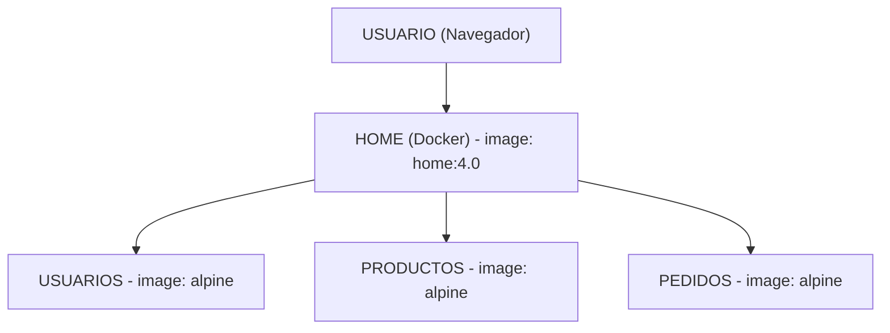

### ¿Cómo funciona nuestra arquitectura?

Por un lado está **el usuario**, que abre su navegador y entra a la página principal. Esa página es el contenedor **`home`**, que funciona como la cara visible de la aplicación y recibe a las personas en el puerto `3000`.

Detrás de esa página de bienvenida, el sistema se divide en tres piezas clave (creadas con Docker Compose) que se encargan de manejar la información del negocio:
* **Usuarios:** Guarda y administra la información de las personas que usan la plataforma.
* **Productos:** Controla todo el catálogo y los artículos disponibles.
* **Pedidos:** Se encarga de procesar las compras que van haciendo los clientes.

### ¿Cómo se comunican entre ellos?

Para que todo funcione en equipo, estos componentes se mandan mensajes cuando lo necesitan:

* Cuando el usuario entra al **Home**, este se comunica con el servicio de **Productos** para pedirle la lista de lo que está a la venta y mostrárselo en pantalla.
* Cuando alguien va a realizar una compra, el servicio de **Pedidos** le pregunta al servicio de **Usuarios** quién está comprando, para saber a qué cliente pertenece la orden.
* Al mismo tiempo, el servicio de **Pedidos** le avisa al servicio de **Productos** qué artículo se quiere llevar, para verificar que haya disponibilidad.
